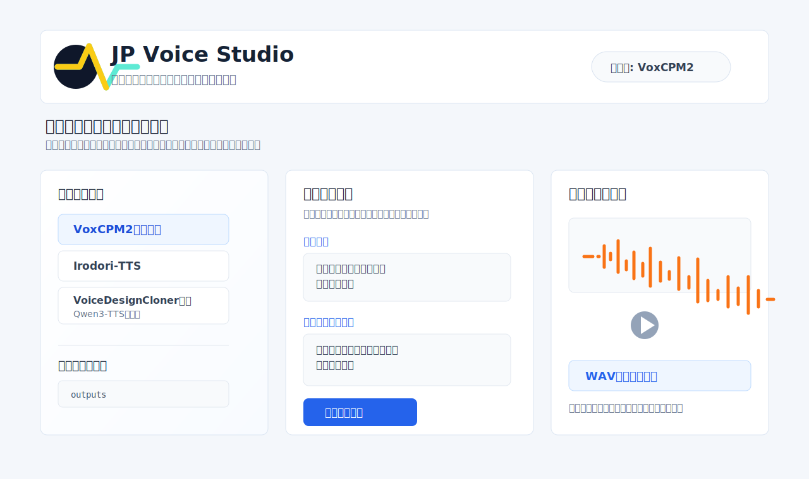

# JP Voice Studio

<p align="center">
  <b>日本語</b> | <a href="./README_en.md">English</a> | <a href="./README_zh.md">中文</a>
</p>

日本語で使いやすい音声生成・声クローン統合ツールです。<br>
OpenBMB/VoxCPMをベースに、日本語UI、Windows CUDAセットアップ、声のデザイン履歴、WAVダウンロード、多言語発話、声のクローン操作を追加しています。任意の追加エンジンとして Irodori-TTS と Qwen3-TTS も利用できます。

元プロジェクト: [OpenBMB/VoxCPM](https://github.com/OpenBMB/VoxCPM)



## 利用ルール

声のクローン、参照音声、履歴音声の再利用は、自分の声、社内で利用許諾を得た音声、または本人から明示的な許可を得た音声だけに使用してください。生成音声を実在人物の発言として偽装したり、第三者の権利を侵害する用途には使わないでください。

社内利用では、参照音声の収集元、本人許諾の有無、利用目的、保存場所をチーム内で確認してから使ってください。

## 主な機能

- 声のデザイン: テキスト指示だけで声を作成
- 声ガチャ: Qwen3-TTS連携で生成数を指定し、複数候補を連続生成して試聴
- コーパス一括音声化（簡易）: Qwen3-TTS連携で選んだ声を使い、1行1文のテキストをまとめてWAV化
- Style-Bert-VITS2向け前処理（簡易）: コーパスの `raw/*.wav` をリサンプルし、`Neutral.txt` から `esd.list` を生成
- Irodori-TTS LoRA学習データ準備: 生成済みコーパスを `lora_data/lab/{話者}/{感情}` 形式へ変換
- Irodori-TTS LoRA学習実行（実験）: ドライランでコマンド確認後、短いステップ数から学習を開始可能
- Irodori-TTS LoRA推論: 学習済みLoRAアダプタを選んでIrodoriの生成・クローンに適用
- Irodori-TTS LoRA管理: 学習済みアダプタ一覧の更新、保存フォルダ表示、学習データ準備から学習入力への自動反映
- 声のデザイン履歴: 作成済みの声を参照して別セリフを生成
- 声のクローン: 参照音声の声質で読み上げ
- 高精度クローン: 参照音声と文字起こしを使って再現性を向上
- 参照音声録音ガイド: 推奨秒数、録音原稿、文字起こし欄への反映を補助
- 多言語発話: 発話言語を選んで読み上げ
- 記号による読み方調整: 強調、間、疑問、語尾などを指定
- 単語ごとのアクセント指定: 平坦、語尾上げ、頭高、中高、尾高をUIから追加
- 音声エンジン切替: VoxCPM2に加えて、Irodori-TTSとVoiceDesignCloner連携（Qwen3-TTS・簡易）を選択可能
- VoiceDesignCloner連携（Qwen3-TTS・簡易）: Voice-Design-Cloner本体を組み込むものではなく、Qwen3-TTSワークフローを参考にした簡易連携
- WAVダウンロード: 生成した音声をそのまま保存
- Windows向け簡単起動スクリプト

## ドキュメント

- [Windows向けセットアップ手順](./README_SETUP_JA.md)
- [最小スモークテスト手順](./docs/SMOKE_TEST_JA.md)
- [サンプル生成と画面イメージ](./docs/SAMPLES_JA.md)
- [GitHub公開・Release作成メモ](./docs/GITHUB_RELEASE_JA.md)
- [Windows実行ファイルの作り直し手順](./docs/WINDOWS_LAUNCHER_BUILD_JA.md)
- [残作業ロードマップ](./docs/ROADMAP_JA.md)

## 対象環境

- Windows 10 / 11
- NVIDIA GPU推奨
- CUDA 12系対応ドライバ
- Python 3.10 または 3.11
- Git
- uv

uvがない場合:

```powershell
winget install --id Astral-sh.UV
```

## クイックスタート

PowerShellで以下を実行します。初回は依存関係とVoxCPM2モデルの取得に時間がかかります。

```powershell
git clone https://github.com/ShibaPapaMikami/VoxCPM-Japanese-WebUI.git
cd VoxCPM-Japanese-WebUI
powershell -ExecutionPolicy Bypass -File scripts\setup_all_windows.ps1
```

起動後、ブラウザで開きます。

```text
http://127.0.0.1:8808/
```

### セットアップ診断

起動できない、任意エンジンが使えない、CUDAが有効か分からない場合は、診断スクリプトを実行します。VoxCPM2、CUDA、Irodori-TTS、Qwen3-TTS、モデルキャッシュ、8808番ポートをまとめて確認できます。

```powershell
powershell -ExecutionPolicy Bypass -File scripts\check_setup.ps1
```

LAN公開で使う場合は、ホスト設定も合わせて確認できます。

```powershell
powershell -ExecutionPolicy Bypass -File scripts\check_setup.ps1 -HostAddress 0.0.0.0 -Port 8808
```

### 2回目以降

```powershell
powershell -ExecutionPolicy Bypass -File scripts\setup_all_windows.ps1 -SkipBaseSetup
```

または、ランチャーを使います。

```powershell
.\VoxCPM_WebUI.cmd
```

### 任意エンジンもまとめて入れる場合

Irodori-TTSとQwen3-TTSも一緒にセットアップする場合は、初回に以下を実行します。

```powershell
powershell -ExecutionPolicy Bypass -File scripts\setup_all_windows.ps1 -AllEngines
```

個別に追加する場合は、`-WithIrodori` または `-WithQwen3` を指定します。

```powershell
powershell -ExecutionPolicy Bypass -File scripts\setup_all_windows.ps1 -WithIrodori
powershell -ExecutionPolicy Bypass -File scripts\setup_all_windows.ps1 -WithQwen3
```

### Irodori-TTSも使う場合

VoxCPM2だけ使う場合は不要です。日本語特化エンジンのIrodori-TTSも使う場合だけ、追加で実行します。

```powershell
powershell -ExecutionPolicy Bypass -File scripts\setup_irodori_tts.ps1
```

完了後にWeb UIを再起動し、画面上部の「音声エンジン」で `Irodori-TTS（日本語特化・実験）` を選びます。

### Qwen3-TTSも使う場合

VoxCPM2だけ使う場合は不要です。Voice-Design-Clonerで採用されているQwen3-TTS系の声デザイン・声クローンも使う場合だけ、追加で実行します。

```powershell
powershell -ExecutionPolicy Bypass -File scripts\setup_qwen3_tts.ps1
```

完了後にWeb UIを再起動し、画面上部の「音声エンジン」で `VoiceDesignCloner連携（Qwen3-TTS・簡易）` を選びます。

Qwen3-TTSの声のクローンでは、参照音声と、その参照音声で話している文字起こしが必要です。Qwen3-TTSで声のデザインを生成した履歴は、WAVの横に参照テキストを保存するため、そのまま「履歴の声で生成」に使えます。

セットアップ時に `SoX could not be found` という警告が出ることがあります。`qwen_tts import ok` が表示されていれば導入自体は完了していますが、生成時に音声前処理エラーが出る場合はSoXの追加インストールを検討してください。

### LAN内の別端末から使う場合

同じLAN内の別端末からアクセスする場合は、起動PCで以下のように起動します。

```powershell
powershell -ExecutionPolicy Bypass -File scripts\setup_all_windows.ps1 -SkipBaseSetup -HostAddress 0.0.0.0
```

別端末のブラウザで開きます。

```text
http://<起動PCのIPアドレス>:8808/
```

必要に応じてWindowsファイアウォールで8808番ポートを許可します。

```powershell
powershell -ExecutionPolicy Bypass -File scripts\setup_all_windows.ps1 -SkipBaseSetup -NoLaunch -AllowFirewall
```

詳しい手順は [README_SETUP_JA.md](README_SETUP_JA.md) を参照してください。

## モデルについて

初回起動時、または初回生成時にVoxCPM2のモデルを取得します。  
モデルは `pretrained_models/` に保存されます。

`pretrained_models/` は大きなファイルを含むため、このリポジトリには含めていません。

### Irodori-TTSを使う場合

Irodori-TTSは任意の追加エンジンです。依存関係の競合を避けるため、このWeb UI本体とは別フォルダ `external/Irodori-TTS/` にセットアップします。手順は上の「Irodori-TTSも使う場合」を参照してください。

Irodori-TTSは日本語専用です。多言語、VoxCPM2の高精度クローン、自由文による細かな声の指示を使う場合は、既定の `VoxCPM2（総合）` を使ってください。

### VoiceDesignCloner連携（Qwen3-TTS・簡易）を使う場合

VoiceDesignCloner連携（Qwen3-TTS・簡易）は任意の追加エンジンです。`scripts/setup_qwen3_tts.ps1` で、このWeb UIの `.venv` に `qwen-tts` と `sentencepiece` を追加します。

Qwen3-TTSは10言語（日本語、英語、中国語、韓国語、ドイツ語、フランス語、ロシア語、ポルトガル語、スペイン語、イタリア語）に対応しています。このWeb UIでは、Voice-Design-ClonerのQwen3-TTSワークフローを参考に、声のデザイン、生成数指定による声ガチャ、参照音声+文字起こしの簡易クローン、選んだ声での簡易コーパス一括音声化、リサンプル、esd.list生成、Irodori-TTS LoRA学習データ準備、LoRA学習実行入口で利用できます。学習済みLoRAはIrodori-TTS選択時の生成・クローンで選択できます。

この連携は、Voice-Design-Cloner本体を同梱・移植するものではありません。JP Voice Studioでは、音声生成・履歴・ダウンロード・簡易学習入口を1つのWeb UIにまとめることを優先し、Style-Bert-VITS2向けの完全自動配置は本体に抱え込まず、`raw/*.wav`、`resampled/*.wav`、`Neutral.txt`、`esd.list` を出力して別ツールへ渡す方針です。

| 機能 | Voice-Design-Cloner本体 | JP Voice StudioのQwen3連携 |
| --- | --- | --- |
| 声の設計 | テキストプロンプトからQwen3-TTSで生成 | 対応。声の基本設定、声の指示、読み上げテキストから生成 |
| 声ガチャ | 気に入るまで複数候補を生成 | 対応。生成数を指定し、候補一覧・再利用用WAV・参照テキストを保存 |
| 声のクローン | 主目的ではない | 簡易対応。参照音声と参照音声の文字起こしを使ってQwen3-TTSで生成 |
| コーパス一括音声化 | 選んだ声で大量文を音声化 | 簡易対応。進捗、失敗行、再実行用TXTを出力 |
| Style-Bert-VITS2前処理 | リサンプル、esd.list生成などを想定 | 簡易対応。`resampled` と `esd.list` を生成。完全自動配置は別ツール連携扱い |
| Irodori-TTS LoRAファインチューン | クローン出力を学習データ化 | 実験対応。学習データ準備、ドライラン、学習コマンド起動入口、LoRA管理に対応 |
| 全自動ワークフロー | 本体側の設計に依存 | 未統合。誤操作を避けるため、生成・前処理・学習を段階ごとに確認するUIに分離 |

## 公式機能との差分

2026-06-13時点で、各公式リポジトリ / モデルカードの最新情報を確認した差分です。JP Voice Studioは、VoxCPM2を中心に、Irodori-TTSとQwen3-TTS / VoiceDesignCloner系ワークフローを1つの日本語Web UIで扱いやすくする統合ツールです。各公式プロジェクトの全機能を完全移植するものではありません。

| エンジン | 公式で確認できる主な機能 | JP Voice Studioで対応済み | 今後埋める候補 |
| --- | --- | --- | --- |
| VoxCPM2 | 30言語、声のデザイン、制御可能な声クローン、高精度クローン、48kHz出力、ストリーミング、batch CLI、Nano-vLLM / vLLM-Omni本番配信、SFT / LoRA | 声のデザイン、声のクローン、高精度クローン、多言語選択、履歴再利用、録音、WAV保存 | VoxCPM2一括生成、ストリーミング再生、本番配信API連携、SFT / LoRA UI |
| Irodori-TTS | 日本語TTS、ゼロショット声クローン、絵文字スタイル制御、VoiceDesign専用モデル、Speaker Inversion、v3 Duration Predictor、SilentCipher透かし、公式学習スクリプト | 日本語生成、参照音声クローン、声質ヒント、Irodori LoRA推論、LoRA学習データ準備、学習入口、LoRA管理 | 絵文字スタイル選択UI、VoiceDesign専用モデル対応、Speaker Inversion、透かし表示、公式学習フローの詳細対応 |
| VoiceDesignCloner / Qwen3-TTS | Qwen3-TTSによる声設計、声ガチャ、コーパス一括音声化、Irodori LoRA、リサンプル、esd.list、Style-Bert-VITS2向け出力、JA / EN / ZH / KO切替、Qwen3-TTS低遅延ストリーミング | Qwen3-TTS簡易連携、生成数指定の声ガチャ、参照音声+文字起こしの簡易クローン、簡易コーパス一括生成、リサンプル、esd.list、Irodori LoRA準備・学習入口 | Style-Bert-VITS2向け出力強化、大量コーパス運用UI、faster-qwen3-tts切替、Qwen3-TTSストリーミング、VoiceDesignCloner本体相当の全自動導線 |

優先して埋める予定:

1. VoxCPM2の一括生成
2. Irodori-TTSの絵文字スタイル選択
3. VoiceDesignCloner連携のStyle-Bert-VITS2向け出力強化
4. VoxCPM2 / Qwen3-TTSのストリーミング再生
5. Irodori-TTSのSpeaker Inversion / VoiceDesign専用モデル対応

## 公開・配布について

このリポジトリはApache-2.0ライセンスのOpenBMB/VoxCPMをベースにし、任意エンジンとしてMITライセンスのIrodori-TTS、Apache-2.0ライセンスのQwen3-TTSを利用できます。<br>
公開時は `LICENSE` を残し、元プロジェクトへのリンクと第三者ライセンス表記を維持してください。

GitHub公開や社内配布の確認項目は [docs/GITHUB_RELEASE_JA.md](docs/GITHUB_RELEASE_JA.md) にまとめています。<br>
主な第三者プロジェクト、モデル、商用利用、声クローンの注意事項は [THIRD_PARTY_NOTICES.md](THIRD_PARTY_NOTICES.md) を確認してください。

## 注意

声のクローンや生成音声の公開・社内配布では、上記の利用ルールに加えて、適用される法律、契約、社内規程、プラットフォームポリシーを確認してください。

## 参考リンク

- [OpenBMB/VoxCPM](https://github.com/OpenBMB/VoxCPM)
- [VoxCPM2 on Hugging Face](https://huggingface.co/openbmb/VoxCPM2)
- [VoxCPM2 on ModelScope](https://modelscope.cn/models/OpenBMB/VoxCPM2)
- [Aratako/Irodori-TTS](https://github.com/Aratako/Irodori-TTS)
- [Irodori-TTS-500M-v3 on Hugging Face](https://huggingface.co/Aratako/Irodori-TTS-500M-v3)
- [reinehonoka/Voice-Design-Cloner](https://github.com/reinehonoka/Voice-Design-Cloner)
- [Qwen3-TTS-12Hz-1.7B-VoiceDesign on Hugging Face](https://huggingface.co/Qwen/Qwen3-TTS-12Hz-1.7B-VoiceDesign)
